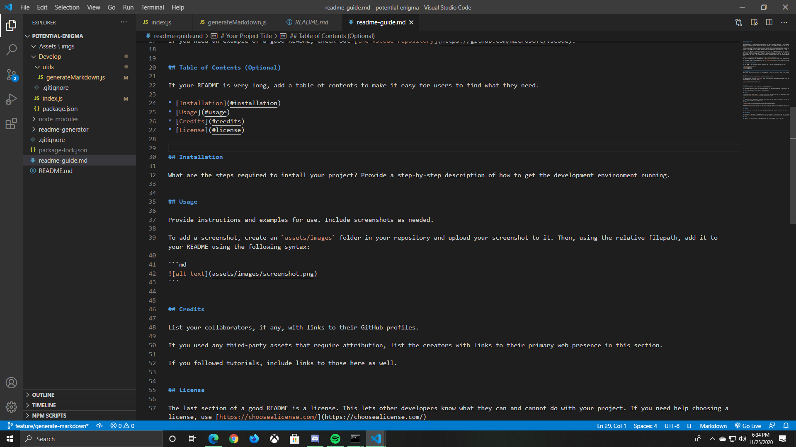

# README Generator
  ## Description
  This is a NODE.js Application that allows you to auto creat a README file. I used Node.js, HTML and CSS
  ## Table Of Contents
    * [Installation](#installation)
    * [Usage](#installation)
    * [Credits](#installation)
    * [License](#installation)
    
  ## Usage
  Simply run the program, (NODE) and fill out the prompts. At the end you will be given an appropriate README.md files
  
    
    
  ## Licenses
  MIT
  

